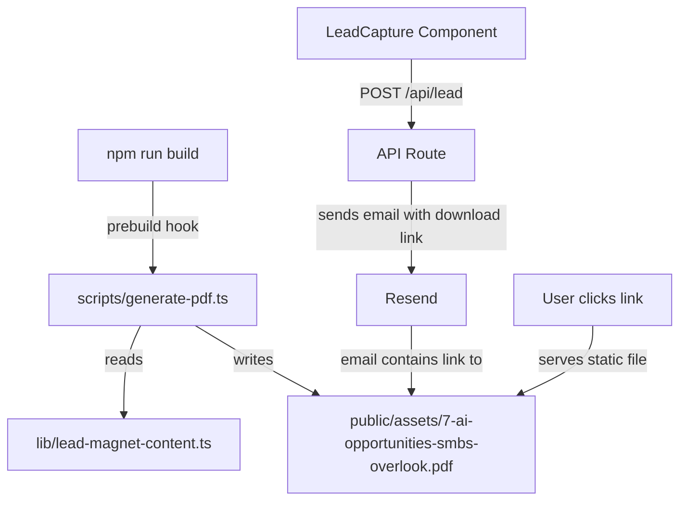
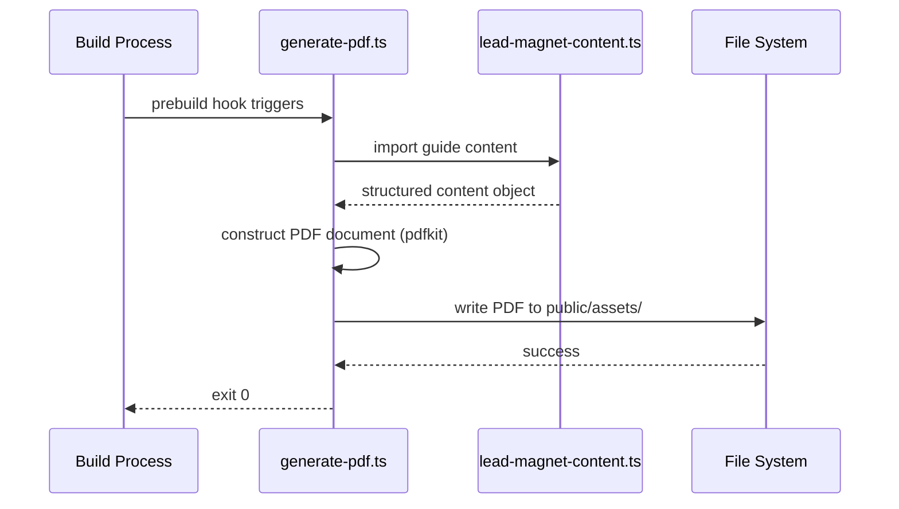
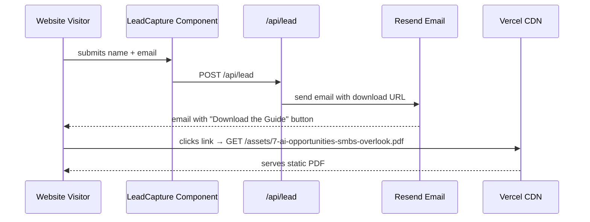

# Design Document: PDF Lead Magnet Delivery

## Overview

This feature generates a branded PDF version of the "7 AI Opportunities Most SMBs Overlook" guide using the user-provided copy, and serves it as a static asset so the existing email delivery flow works without modification. The PDF is generated at build time via a Node.js script (similar to the existing `generate-og.js` pattern), producing a file at `public/assets/7-ai-opportunities-smbs-overlook.pdf`. The existing HTML version is also updated to match the new content.

The approach favors build-time generation over on-demand rendering because the content is static, Vercel serves static files efficiently from `/public`, and the existing `LEAD_MAGNET_URL` constant already points to the correct path. No changes to the LeadCapture component or `/api/lead` route are required.

## Architecture



## Sequence Diagrams

### PDF Generation (Build Time)



### User Download Flow (Runtime — unchanged)



## Components and Interfaces

### Component 1: Lead Magnet Content Module (`lib/lead-magnet-content.ts`)

**Purpose**: Single source of truth for the guide's text content, consumed by both the PDF generator and the updated HTML file.

**Interface**:
```typescript
export interface Opportunity {
  number: number
  title: string
  body: string
}

export interface GuideContent {
  title: string
  author: string
  introduction: string
  opportunities: Opportunity[]
  closing: string
  signOff: string
  ctaHeadline: string
  ctaBody: string
  ctaUrl: string
}

export const guideContent: GuideContent
```

**Responsibilities**:
- Store the complete guide text as a typed object
- Export content for reuse by PDF script and HTML template generator
- Serve as the canonical source when content needs updating in the future

### Component 2: PDF Generator Script (`scripts/generate-pdf.ts`)

**Purpose**: Build-time script that renders the guide content into a branded, accessible PDF file.

**Interface**:
```typescript
// Entry point — no exports, runs as CLI script
// Usage: npx tsx scripts/generate-pdf.ts

function generatePdf(content: GuideContent): Promise<void>
```

**Responsibilities**:
- Import content from `lib/lead-magnet-content.ts`
- Create a multi-page PDF with brand styling (Sora font, navy/teal palette)
- Write the PDF to `public/assets/7-ai-opportunities-smbs-overlook.pdf`
- Set PDF metadata (title, author, subject) for accessibility
- Run idempotently — safe to call multiple times

### Component 3: HTML Guide Update (`public/assets/7-ai-opportunities-smbs-overlook.html`)

**Purpose**: Updated static HTML version matching the new copy, for users who prefer web viewing.

**Responsibilities**:
- Display the same 7 opportunities from the new content
- Maintain existing styling and print styles
- Keep CTA linking to Calendly

## Data Models

### GuideContent

```typescript
interface GuideContent {
  title: string            // "The 7 AI Opportunities Most SMBs Overlook"
  author: string           // "Meridian Solutions, LLC"
  introduction: string     // Multi-paragraph intro text
  opportunities: Opportunity[]  // Exactly 7 items
  closing: string          // Closing paragraph(s)
  signOff: string          // "Kevin Barnett · Meridian Solutions, LLC · ..."
  ctaHeadline: string      // CTA box headline
  ctaBody: string          // CTA box description
  ctaUrl: string           // Calendly URL (from constants)
}

interface Opportunity {
  number: number           // 1-7
  title: string            // e.g., "Speed-to-quote"
  body: string             // Description paragraph
}
```

**Validation Rules**:
- `opportunities` array must have exactly 7 items
- `number` must be sequential 1–7
- All string fields must be non-empty
- `ctaUrl` must be a valid URL

## Algorithmic Pseudocode

### PDF Generation Algorithm

```typescript
async function generatePdf(content: GuideContent): Promise<void> {
  // Step 1: Initialize PDF document
  const doc = new PDFDocument({
    size: 'LETTER',
    margins: { top: 72, bottom: 72, left: 72, right: 72 },
    info: {
      Title: content.title,
      Author: content.author,
      Subject: 'AI opportunities guide for SMBs',
    },
  })

  // Step 2: Pipe to output file
  const outputPath = path.join(__dirname, '..', 'public', 'assets', '7-ai-opportunities-smbs-overlook.pdf')
  const stream = fs.createWriteStream(outputPath)
  doc.pipe(stream)

  // Step 3: Render cover/header
  renderHeader(doc, content.title, content.author)

  // Step 4: Render introduction
  renderIntroduction(doc, content.introduction)

  // Step 5: Render each opportunity
  for (const opportunity of content.opportunities) {
    renderOpportunity(doc, opportunity)
  }

  // Step 6: Render closing and CTA
  renderClosing(doc, content.closing, content.signOff)
  renderCTA(doc, content.ctaHeadline, content.ctaBody, content.ctaUrl)

  // Step 7: Finalize
  doc.end()
  await streamFinished(stream)
}
```

**Preconditions:**
- `content` is a valid `GuideContent` object with all fields populated
- Output directory `public/assets/` exists
- PDF library (pdfkit) is available as a dev dependency

**Postconditions:**
- A valid PDF file exists at `public/assets/7-ai-opportunities-smbs-overlook.pdf`
- PDF contains all 7 opportunities with correct content
- PDF metadata is set (title, author)
- File is overwritten if it already exists

**Loop Invariants:**
- Each opportunity is rendered in order (1–7)
- Page breaks are inserted as needed to avoid content overflow

## Key Functions with Formal Specifications

### Function 1: `renderHeader(doc, title, author)`

```typescript
function renderHeader(doc: PDFDocument, title: string, author: string): void
```

**Preconditions:**
- `doc` is an active PDFDocument instance (not ended)
- `title` and `author` are non-empty strings

**Postconditions:**
- Brand logo mark ("▲ Meridian Solutions") is rendered at top
- Title is rendered in large bold font
- Author line is rendered below title
- Cursor position is advanced past the header content

### Function 2: `renderOpportunity(doc, opportunity)`

```typescript
function renderOpportunity(doc: PDFDocument, opportunity: Opportunity): void
```

**Preconditions:**
- `doc` is an active PDFDocument instance
- `opportunity.number` is between 1 and 7
- `opportunity.title` and `opportunity.body` are non-empty

**Postconditions:**
- Opportunity number and title are rendered as a heading
- Body text is rendered below in body font
- Vertical spacing separates this opportunity from the next
- A page break is inserted if remaining page space is insufficient

### Function 3: `generatePdf(content)`

```typescript
async function generatePdf(content: GuideContent): Promise<void>
```

**Preconditions:**
- `content` passes validation (7 opportunities, all fields present)
- Write access to `public/assets/` directory

**Postconditions:**
- PDF file exists at the expected path
- PDF is valid and readable by standard PDF viewers
- File size is reasonable (< 500KB for text-only content)

## Example Usage

```typescript
// scripts/generate-pdf.ts
import { guideContent } from '../lib/lead-magnet-content'
import PDFDocument from 'pdfkit'
import fs from 'fs'
import path from 'path'

const outputPath = path.resolve(__dirname, '..', 'public', 'assets', '7-ai-opportunities-smbs-overlook.pdf')

const doc = new PDFDocument({
  size: 'LETTER',
  info: {
    Title: guideContent.title,
    Author: guideContent.author,
  },
})

doc.pipe(fs.createWriteStream(outputPath))

// Header
doc.fontSize(10).fillColor('#00D4B4').text('▲ Meridian Solutions', { align: 'left' })
doc.moveDown(0.5)
doc.fontSize(22).fillColor('#0C3D5C').text(guideContent.title, { align: 'left' })
doc.moveDown(0.3)
doc.fontSize(10).fillColor('#666666').text(guideContent.author)
doc.moveDown(1.5)

// Introduction
doc.fontSize(11).fillColor('#333333').text(guideContent.introduction, { lineGap: 4 })
doc.moveDown(1)

// Opportunities
for (const opp of guideContent.opportunities) {
  doc.fontSize(13).fillColor('#0C3D5C').text(`${opp.number}. ${opp.title}`)
  doc.moveDown(0.3)
  doc.fontSize(10.5).fillColor('#333333').text(opp.body, { lineGap: 3 })
  doc.moveDown(1)
}

// Closing
doc.fontSize(11).fillColor('#333333').text(guideContent.closing, { lineGap: 4 })
doc.moveDown(1.5)
doc.fontSize(10).fillColor('#666666').text(guideContent.signOff)

doc.end()
console.log(`PDF generated: ${outputPath}`)
```

## Correctness Properties

### Property 1: PDF file exists after generation

For all build runs, the file `public/assets/7-ai-opportunities-smbs-overlook.pdf` must exist and be non-empty after the generate script completes.

**Validates: Requirements 2.2, 2.6**

### Property 2: Content integrity

For all opportunities in `guideContent.opportunities`, the generated PDF text content must include that opportunity's title. No opportunity may be silently dropped.

**Validates: Requirements 2.3, 1.2**

### Property 3: Idempotency

Running the generate script twice in succession with identical input content produces byte-identical PDF output.

**Validates: Requirements 2.6**

### Property 4: URL consistency

The `LEAD_MAGNET_URL` constant in `lib/constants.ts` must equal `'/assets/7-ai-opportunities-smbs-overlook.pdf'`, matching the generated file's path.

**Validates: Requirements 5.3, 6.3**

### Property 5: Content count invariant

`guideContent.opportunities.length === 7` — the content module always exports exactly 7 opportunities with sequential numbering 1–7.

**Validates: Requirements 1.1, 1.2, 6.1**

### Property 6: HTML and PDF content parity

For all opportunities in `guideContent.opportunities`, both the HTML file and the PDF file contain the opportunity title — ensuring the two delivery formats stay in sync.

**Validates: Requirements 4.1, 1.1**

## Error Handling

### Error Scenario 1: PDF Library Not Installed

**Condition**: `pdfkit` is not in `devDependencies` when script runs
**Response**: Script fails with clear error message: "pdfkit not found. Run: npm install --save-dev pdfkit @types/pdfkit"
**Recovery**: Developer installs the dependency and re-runs

### Error Scenario 2: Output Directory Missing

**Condition**: `public/assets/` directory does not exist
**Response**: Script creates the directory using `fs.mkdirSync(dir, { recursive: true })`
**Recovery**: Automatic — no manual intervention needed

### Error Scenario 3: Write Permission Error

**Condition**: Cannot write to the output path (CI environment, permissions)
**Response**: Script exits with non-zero code and logs the filesystem error
**Recovery**: Fix permissions or adjust CI configuration

### Error Scenario 4: Content Validation Failure

**Condition**: `guideContent` does not pass validation (wrong number of opportunities, empty fields)
**Response**: Script throws a descriptive validation error before attempting PDF generation
**Recovery**: Fix content in `lib/lead-magnet-content.ts`

## Testing Strategy

### Unit Testing Approach

- Validate `guideContent` structure (7 opportunities, all fields non-empty, sequential numbers)
- Test content module exports correct types
- Use Vitest (already in project)

### Property-Based Testing Approach

**Property Test Library**: fast-check (already in devDependencies)

- Property: Any valid `GuideContent` with 7 opportunities produces a non-empty PDF buffer
- Property: Content module always exports an object matching the `GuideContent` interface
- Property: Opportunity numbers are always sequential 1–7

### Integration Testing Approach

- Run the generate script and verify the output file exists and is a valid PDF (check magic bytes `%PDF-`)
- Verify the HTML file contains all opportunity titles from the content module
- Verify `LEAD_MAGNET_URL` path matches the generated file location

## Performance Considerations

- PDF generation runs only at build time, not at runtime — zero impact on page load
- The generated PDF is text-only (no images), keeping file size under 100KB
- Vercel serves static files from CDN with proper caching headers
- No runtime PDF generation means no serverless function cold starts for downloads

## Security Considerations

- The PDF is a public, unauthenticated asset (intentional — it's a lead magnet)
- No user input flows into PDF generation (content is hardcoded in source)
- Email delivery security is handled by the existing Resend integration (unchanged)
- The download URL is not guessable from the email alone, but is intentionally public

## Dependencies

| Dependency | Type | Purpose |
|-----------|------|---------|
| pdfkit | devDependency | PDF document generation at build time |
| @types/pdfkit | devDependency | TypeScript types for pdfkit |
| tsx | devDependency | Run TypeScript scripts directly (already implied by tsconfig) |

**Existing dependencies (unchanged)**:
- Next.js 14 — framework
- Resend — email delivery
- Vitest + fast-check — testing
